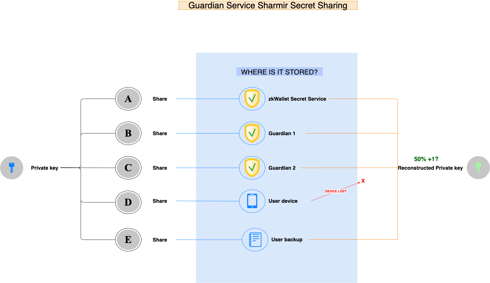

# **WalletZkApp**
A Mina Protocol Smart Contract **"Keyless"** wallet.

 
 

# **_Introduction_**
Introducing **zkApp Keyless Wallet** - the smart contract wallet that offers effortless security for your cryptocurrency. In a market where wallet security and usability are major concerns, zkApp Keyless Wallet provides an easy-to-use and secure solution. Our mobile-ready wallet uses Social Recovery, SmartOTP's, Biometric hash data and Shamir Secret Sharing, allowing users to restore access without revealing any personal information, using zero-knowledge proof. We also enable advanced security features like social recovery, plus, our integration of Google Auth ensures familiarity and secure transactions. zkApp Keyless Wallet is designed for both seasoned cryptocurrency experts and newcomers, offering a smooth and hassle-free experience. With zkApp Keyless Wallet , you have full custody and self-control of your wallet. Don't risk losses or thefts, make the smart choice with zkApp Keyless Wallet .

 
 

# **_Problem Statement_**
These are the problems that current wallet users face:
- [Cryptocurrency wallet security is a really big problem](#problem-1)
- [Cryptocurrency wallets are hard to use for average users](#problem-2)
- [Hardware wallets alone are not good enough](#problem-3)
- [Mnemonic phrases are not good enough](#problem-4)
 
 

## **Cryptocurrency wallet security is a really big problem**
Wallet security is a major concern in the cryptocurrency ecosystem, with numerous stories of losses and thefts plaguing the industry. Hardware wallets, while considered to be the most secure type of wallet, are not foolproof and can still be vulnerable to attacks. Software wallets and web wallets, on the other hand, are more vulnerable to attacks due to their connection to the internet.

In addition, losses can occur due to the loss of private keys or the forgetting of passwords. This can be catastrophic, as there is often no way to recover lost funds. The importance of the wallet security problem cannot be underestimated, and it is essential that solutions be developed to reduce the quantity of losses and thefts taking place.
 
 

## **Cryptocurrency wallets are hard to use for average users**

Many cryptocurrency users, especially those who are new to the space, find it difficult to navigate the complexities of wallets and transactions. The process of setting up a wallet, transferring funds, and executing smart contracts can be confusing and intimidating for those who are not tech-savvy. This can lead to a lack of adoption, as users may be hesitant to use cryptocurrency if they do not feel comfortable with the process.
 
 

### **Hardware wallets alone are not good enough**

Hardware wallets are often touted as the best-in-class solution for cryptocurrency funds management. However, they are not foolproof and can still be vulnerable to attacks. In addition, they may not be user-friendly for those who are not tech-savvy, and can be lost or stolen. While hardware wallets do provide an additional layer of security, they are not a standalone solution to the wallet security problem.
 
 

## **Mnemonic phrases are not good enough**

Mnemonic phrases, also known as seed phrases or recovery phrases, are a common method of backing up and restoring wallet data. They are a series of words that can be used to recreate a user's private keys and restore access to their funds. However, mnIf you lose your wallet but you have the mnemonic phrase, you can input the phrase when setting up a new wallet to recover your account, as the mnemonic phrase contains the root key from which all of your other keys can be generated.

Mnemonic phrases are good for protecting against loss, but they do nothing against theft. Even worse, they add a new vector for theft: if you have the standard hardware wallet + mnemonic backup combo, then someone stealing either your hardware wallet + PIN or your mnemonic backup can steal your funds. Furthermore, maintaining a mnemonic phrase and not accidentally throwing it away is itself a non-trivial mental effort.
 
 
## **_Solution_**
**zkApp Keyless Wallet Using Social Recovery, Smart OTPs and Sharmir Secret Sharing**

One of the challenges of using cryptocurrency wallets is the need to manage private keys, which can be difficult for average users and can also create security risks. To address this challenge, we want to implemented keyless authentication using **Social Recovery** and Smart OTPs.
 
 
## **Social Recovery**
Social Recovery is a way to recover your wallet without using a seed phrase  or private key while being **fully non-custodial**. It’s Vitalik Buterin’s preferred wallet recovery method, and in this [article](https://vitalik.ca/general/2021/01/11/recovery.html), we explain how it works.

Our solution on social recovery, uses zero-knowledge proof, without revealing any information about the social contracts or their guardians. This creates a resilient system that is resistant to thefts, cracks, loss, censorship, or coersions, and helps to ensure that funds are recoverable through time locks and multiple safety nets.
 
 
### **Social Recovery Recovering process**
Once user signup with 2FA or Socail Login and minimun of 3 guardians are added, recovering a wallet is super easy.

1. Download or open zkWallet app.
2. Login using 2FA or Social Login
2. Use guardians to approve user request to recover user wallet.

That's it. All without needing to use privatekey or seed phrase!

 
 

## **Smart OTPs**
Smart OTPs, which use zero-knowledge proof, provide an additional layer of security. These one-time passwords are self-sovereign, meaning that they do not rely on third parties or designated guardians. They are also air-gapped, which minimizes the risk of key-loggers and man-in-the-middle attacks. 

Smart OTP's can be use as:
- **Quick transfer**: Send a small amount of fund (e.g., $100) using a random 6-digit code generated by Google Authenticator
- **Spending limit**: Control spending with customizable daily limits (e.g., $1000)
- Google Auth verification
- As main Guardian of your wallet
- Email/SMS OTP's verification (out of scope)

 
 

### **Visibility of OTP Merkle Tree**

In our design, the OTP Merkle Tree is not necessarily made public. This distinction is because of two differences: (1) the OTPs generated by Google Authenticator are time-based, and (2) the OTPs are never re-used. Since each OTP code is valid for 30 seconds, we only need to generate about 1 million codes to cover a one-year lifespan of a wallet. In all but the most extreme corner use cases, the user would not be using the wallet during the wallet's lifespan; hence, only a tiny portion of the 1 million OTP codes would be used. See also depletion of OTPs to add/update new OTPs.

### **Depletion of OTPs**
Even with the previous modification, the number of OTPs remains bounded, therefore they may be depleted. We propose handling of depleted OTPs by a special operation that replaces the current tree with a new one. To introduce a new tree securely, we propose updating R value while using the last OTP of the current tree for confirmation.

## **Sharmir Secret Sharing**
Shamir Secret Sharing is a method for distributing a secret among multiple parties, where only a minimum number of parties are required to reconstruct the secret. This technique can be used to enhance the security of cryptocurrency wallets, as it provides an additional layer of protection against theft and loss.

In the context of the zkApp Keyless Wallet, Shamir Secret Sharing will be used to distribute the user's private key among multiple parties as guardian services. The user can choose the number of parties that are required to reconstruct the private key, and these parties can be designated as trusted friends or family members.

This approach provides several benefits:
- **Enhanced security**: By distributing the private key among multiple parties, the risk of theft or loss is reduced. Even if one or two of the parties are compromised, the private key cannot be reconstructed without the minimum number of required parties.

- **Flexibility**: The user can choose the number of parties required to reconstruct the private key, providing flexibility in balancing security and convenience.

- **Ease of use**: The process of distributing the private key can be made user-friendly, allowing even non-technical users to set up and manage the Shamir Secret Sharing process.

- **Zero-knowledge proof**: The use of zero-knowledge proof ensures that the parties involved in the reconstruction process do not have access to the private key itself, but only to the necessary pieces of information required for the reconstruction.

 
 

## **Guardian Service**
Guardian services are an essential component of the zkApp Keyless Wallet to ensure the security of user's private keys. Here are three types of guardian services that can be used:
  - **Official Guardian Services**: These are the guardians who have been verified and approved by the company, such as a Notary. The identity of these guardians is checked by the company, and they are rated by the Mina community using the Zero Knowledge rating service. Users can select these guardians based on their ratings and expertise. These guardians are expected to follow strict protocols and procedures to ensure the safety and security of the user's private keys.
  - **Non-official Guardians**: Users can also choose non-official guardians, such as their Aurora wallet or their friends and family's wallet. These guardians are not verified by the company, but they can still provide an additional layer of security to the user's wallet. However, users should be aware that these guardians may not have the same level of expertise or follow the same protocols as the official guardians.
  - **Guardian Service Shamir Secret Sharing**: This type of guardian service is particularly useful for any private key wallet. Shamir Secret Sharing is a cryptographic algorithm that divides a secret into multiple shares, which are then distributed among different parties. In the context of the zkApp Keyless Wallet, Shamir Secret Sharing can be used to distribute the user's private key among multiple guardians. Each guardian will hold a share of the secret, and the secret can only be reconstructed if a certain number of guardians come together to combine their shares. This ensures that no single guardian has access to the user's private key and provides an additional layer of security.

### **Guardian Service Shamir Secret Sharing Recovery Process**
  

The Guardian Service Shamir Secret Sharing recovery process is a method for recovering a user's private key that has been split into multiple pieces and distributed among multiple guardians using the Shamir Secret Sharing algorithm.

If the user needs to recover their private key, they would first initiates the recovery process by logging in to their account using either 2FA or social login Our Recovery service then use their share of the key to reconstruct the original private key.

To do this, the guardians would need to come together and combine their shares of the key using the Shamir Secret Sharing algorithm. The algorithm would use a predetermined threshold of shares to reconstruct the original private key.

Once the private key has been reconstructed, it can be used to access the user's wallet and assets. The guardians must ensure that the private key is kept secure and confidential during the recovery process to prevent unauthorized access to the user's assets.

It is important to note that the Shamir Secret Sharing recovery process is designed to be secure and reliable, but it does rely on the guardians to properly store and protect their shares of the private key. Therefore, it is important to carefully choose and trust the guardians who will hold shares of the user's private key.

 
 

## **Paymaster Relayer**
The Paymaster Relayer is a solution that facilitates transaction sponsorship for the Smart Contract Wallet. It allows third-party mechanisms to pay for transactions, which can be useful for users who want to pay gas fees using their own smart contract wallet.

One advantage of using the Paymaster Relayer is that it allows users to **pay gas fees using any token**, which can be more convenient than having to use a specific token. Additionally, it provides the option to **pay gas fees with fiat money**, which can be especially helpful for users who are not familiar with cryptocurrencies or who do not have access to them.

It's important to note that the Paymaster Relayer is a **temporary solution**, as it currently checks if the wallet has Mina balance. However, there are ongoing efforts to allow fee-payment with proofs (#398) or to implement Account Abstraction for the Mina Protocol, which could potentially provide a more long-term solution.

 
 

# **_Resources_**
- Website: [www.walletZk.app](https://www.walletZk.app)
- Github: [@WalletZkApp](https://github.com/WalletZkApp)
- zkIgnite proposal: [zkApp Keyless Wallet](https://zkignite.minaprotocol.com/zkignite/zkapp-track-1/phase1-refineproposals/suggestion/236)
